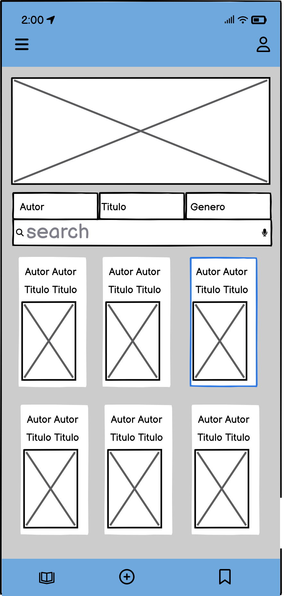
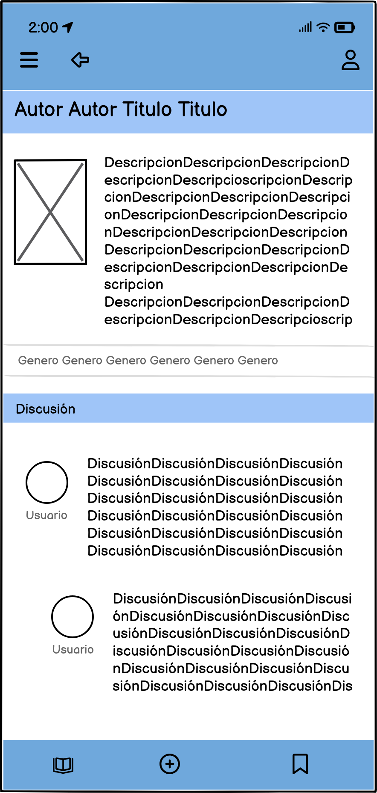
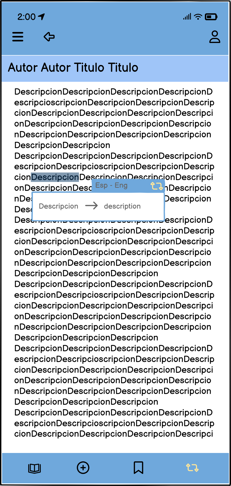
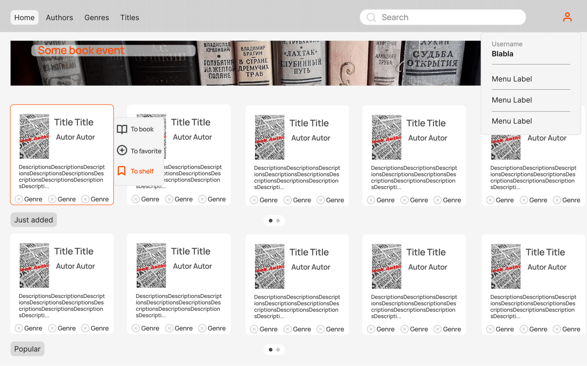
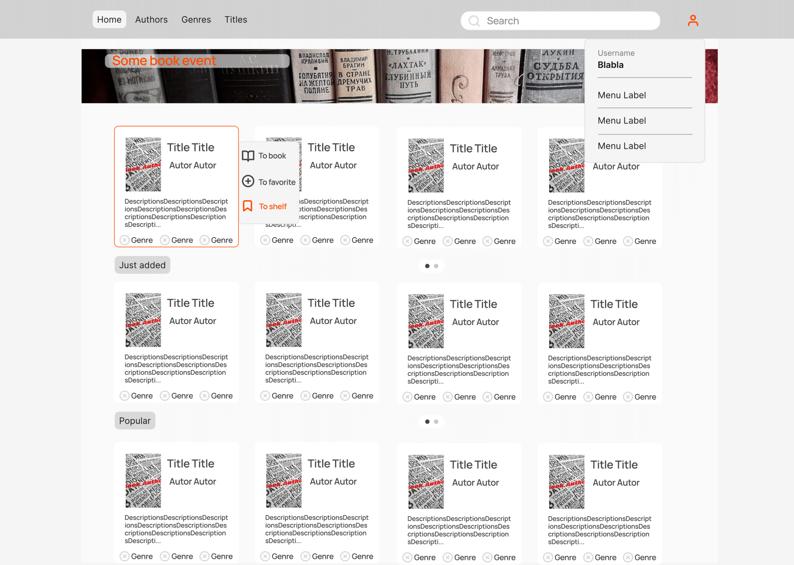
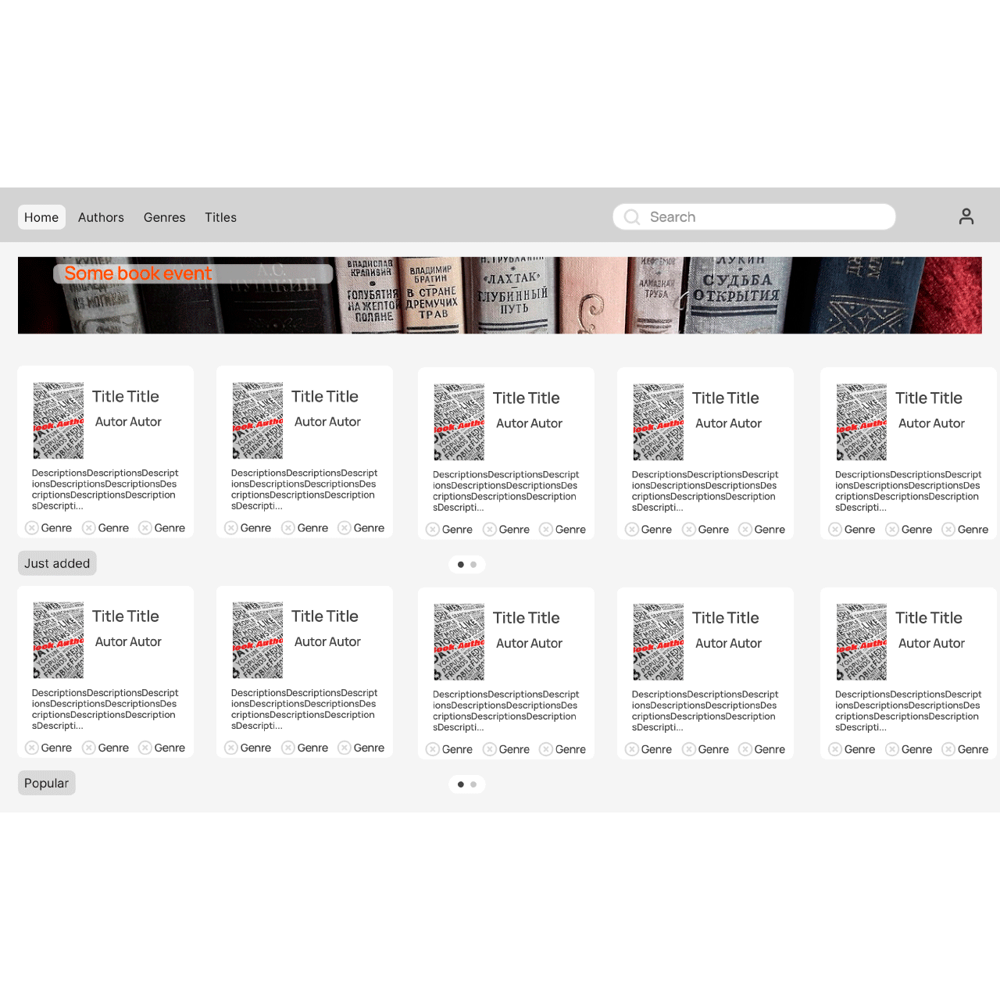

# Actividad 2: Mockups, Wireframes y Prototipos

## Idea de la aplicación web
La aplicación web será una librería online multilingüe que permitirá a los usuarios comprar, leer y discutir libros en varios idiomas. Su característica principal será un traductor integrado que identificará y traducirá solo las palabras o frases desconocidas seleccionadas por el usuario mientras leen, mejorando la comprensión sin interrumpir la fluidez de la lectura. Además, los lectores podrán participar en discusiones sobre los libros, compartir opiniones y recomendaciones en una comunidad global de lectores.

## Wireframe

### Página principal

### Página del libro

### Página de lectura del libro

## Mockup

### Versión para tablets

### Versión para escritorio

### Versión para dispositivos móviles

## Prototipo

### La interacción entre la página principal, la página del libro y la página de lectura

[Prototipo](https://www.figma.com/proto/7KA1gSzUAB7ugiLSfYMGPW/Untitled?node-id=11-310&t=X85g1MFXRMNOxB2q-1)

